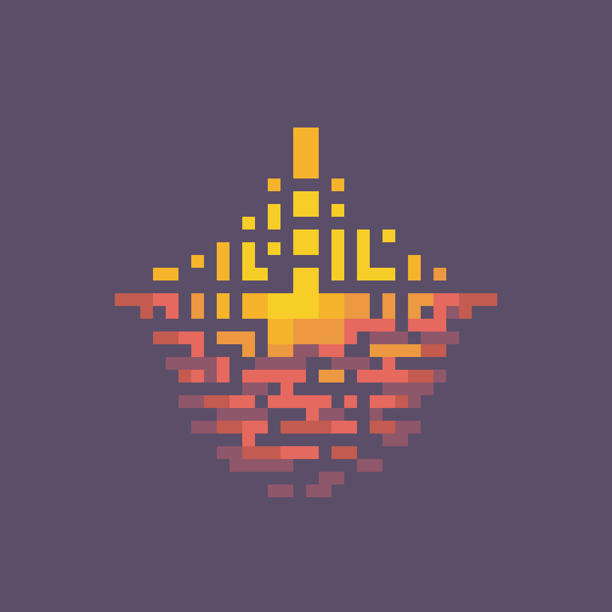

  
  <section>
    <h3>Radiance ✨</h3>
    Radiance is a game engine based on Raylib, featuring hot-reloading, scene management & build system. Inspired by the Cargo environment, it offers a CLI interface without the need to open a new window. Radiance is designed to be minimal, with a few built-ins added to facilitate the creation of games such as: Static globals, Networking, Physics, Pathfinding, UI system & Entity Component System.
  </section>

